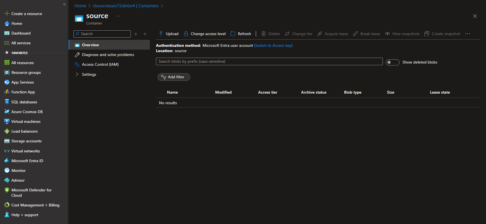

<div align="center">

# Blob Data Sharing with Azure Functions Flex Consumption

[](https://codespaces.new/charliewei0716/blob-data-sharing?quickstart=1)

Construct a high-performance, low-latency data sharing solution between different Azure Storage Accounts using [Azure Functions Flex Consumption](https://learn.microsoft.com/en-us/azure/azure-functions/flex-consumption-plan) and the [Copy Blob API](https://learn.microsoft.com/en-us/azure/storage/blobs/storage-blob-copy-python).


</div>

## Features

- Opting for the consumption, which offers a [serverless billing model based on usage](https://learn.microsoft.com/en-us/azure/azure-functions/flex-consumption-plan#billing), as the primary computing core to meet cost considerations.
- Support for flex consumption in [Virtual Network Integration](https://learn.microsoft.com/en-us/azure/azure-functions/flex-consumption-plan#virtual-network-integration), establishing the minimum network allowance architecture for a Storage-Eventgrid trigger.
- The key functionality is realized through the server-to-server [Blob Copy API](https://learn.microsoft.com/en-us/rest/api/storageservices/copy-blob?tabs=microsoft-entra-id), which offers the advantages of being highly efficient, exceptionally reliable, and low-code maintenance.
- Using [the Python SDK to operate the Blob Copy API](https://learn.microsoft.com/en-us/azure/storage/blobs/storage-blob-copy-python) and implementing the [authentication required](https://learn.microsoft.com/en-us/rest/api/storageservices/copy-blob?tabs=microsoft-entra-id#authorization) for cross storage account scenarios.

## Getting Started

1. This repository has been optimized for GitHub codespaces. Please use the following badge to open a web-based version of VS Code in your browser.

    [](https://codespaces.new/charliewei0716/blob-data-sharing?quickstart=1)
   
3. Login to your Azure account with device authorization grant flow.
   
   ```
   azd auth login --use-device-code
   ```
   ```
   az login --use-device-code
   ```
> [!NOTE]
> Due to the [handshake validation process required](https://learn.microsoft.com/en-us/azure/event-grid/webhook-event-delivery#endpoint-validation-with-event-grid-events) when creating an Azure Event Grid, we must use the `az` command and the identity from `az login` to establish the event subscription within the post-deployment script.

3. Provision Azure resources and deploy the application code.
   
   ```
   azd up
   ```
   
   - Enter the environment name, Azure subscription, and the location of the Azure resources one by one as instructed.
   - This process involves using `./scripts/postdeploy.sh` to set up a webhook for an Azure Function.
  
   

## Testing in Azure Portal

Follow these steps to conduct end-to-end testing on the Azure Portal.

1. In the Azure Portal, locate the resource group named `rg-<your-environment-name>` and the two storage accounts named `stsource<hash-string>` and `sttarget<hash-string>` respectively.
   
2. Modify the above storage account settings.
   - If you are not located within the VNet, you must check **Add your client IP address** in the firewall settings.
   - Assign yourself the **Blob Data Contributor** role at the resource group or storage account level.
    
3. Refer to the animation example below. By uploading a file into the container named `source`, you will be able to see the file in the container named `target` within a few seconds.

<div align="center">
    
</div>

## Clean Up

Execute the following command to remove all resources. This will ensure you do not incur any unnecessary costs after completing your testing or usage.
```
azd down
```

## Reference

Here are some resources to learn more about the technologies used in this repository:

- [Azure Functions Flex Consumption plan hosting](https://learn.microsoft.com/en-us/azure/azure-functions/flex-consumption-plan)
- [Copy Blob (REST API)](https://learn.microsoft.com/en-us/rest/api/storageservices/copy-blob?tabs=microsoft-entra-id)
